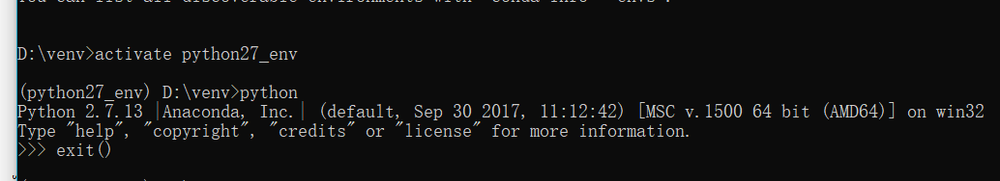

### 常用命令

conda -V (大写) 查看版本

conda list 查看安装了哪些包

conda env list 或 conda info -e 查看当前存在哪些虚拟环境

conda update conda 检查更新当前的conda 

### 创建Python虚拟环境

conda create -n your_env_name python=X.X(版本)  创建指定Python版本的虚拟环境

**激活**    activate  your_env_name

#### 对指定虚拟环境安装扩展包

conda install -n your_env_name [package_name]

#### 卸载指定的安装包

conda remove -n your_env_name  --all    全部卸载

conda remove --name your_env_name [package_name]  卸载某个包

