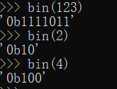
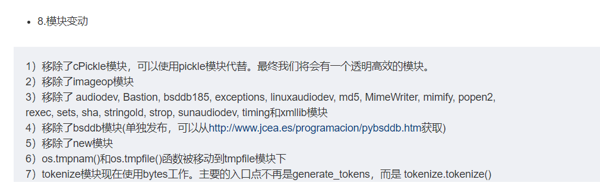
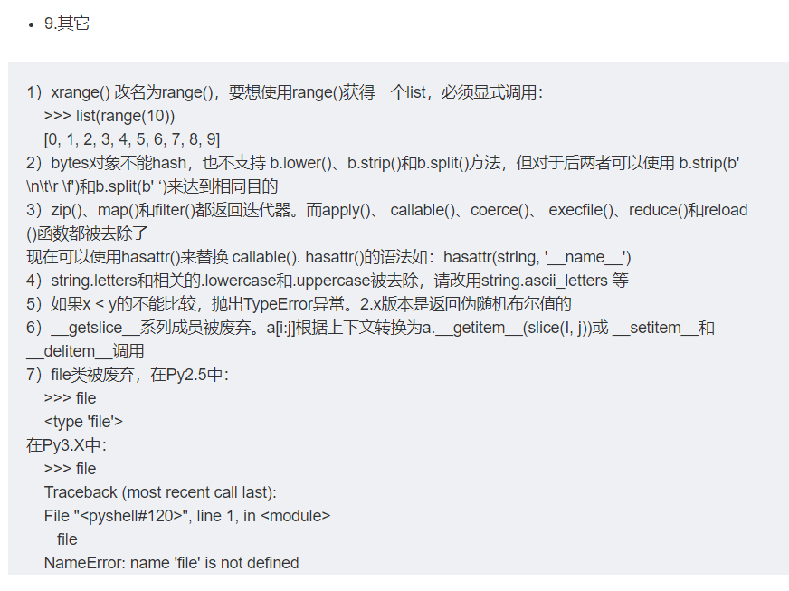

### python3和python2的区别

注：没有特别说明的都是 python3 的特性

#### 性能

2的性能比3的性能高越 15%-30%

#### 编码

3使用的是 utf-8

#### 语法

去除了`<>` 全部使用 ！=

全部改用 repr() 去除 ``

加入关键子 as和with, 还有True,False None

整型相除得到的是浮点数， // 得到的是整型

加入 nolocal

将print关键子去除，添加 print() 方法

- print "This is", 2*2
- print >> sys.stderr. 'fatal error'     3.X    print("fatal error", file=sys.stderr)

x < y  当 x 和 y 的类型不匹配抛出 Typeerror 而不是随机的 bool 值

输入函数改变

- 2  ： raw_input("请输入：")
- 3  ： input("请输入：")

不能定义函数如下

- def(a, (b, c)): pass

增加了二进制字面量和bin() 函数

`a, b, *rest = seq` 是合法的

在定义类的 init 时，新的super 可以不再给super()传参数

新的 metaclass 语法

支持 class decorater  即，类装饰器

3中的默认字符串类型是 2 中的unicode类型

3去除了long类型，只有一种类型 int

新增 bytes 类型，对应 2 中的八位串

str 和 bytes 类型可以相互转换 encode 和 decode

dict的 .keys()、.items 和 .values() 方法返回迭代器，而之前的 iterkeys()、dict.has_key() 都被废弃

面型对象， 引入抽象基类

所有的异常都从 BaseException 继承，去除了 error.message的方法

用 raise Exception(args) 代替 raise Exception,args语法

