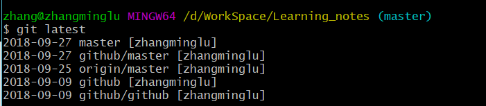

#### 给Git设置alias别名

修改git的config文件，只是针对当前git仓库进行修改

```bash

[alias]
    st = status
    ck = checkout
    cl = clone
    br = branch
    mg = merge
    cm = commit 
    cmd = commit --amend
    df = diff
    dft = difftool
    mt = mergetool
    last = log -1 HEAD
    cf = config
    line = log --oneline
    latest = for-each-ref --sort=-committerdate --format='%(committerdate:short) %(refname:short) [%(committername)]'
    lg = log --pretty=format:\"%C(yellow)%h %C(blue)%ad %C(red)%d %C(reset)%s %C(green)[%cn]\" --decorate --date=short
    graph = log --pretty=format:\"%C(yellow)%h %C(red)%d %C(reset)%s %C(green)[%an] %C(blue)%ad\" --topo-order --graph --date=short
    type = cat-file -t
    dump = cat-file -p
```




