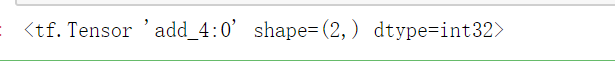

```python
constant   # 定义常量
a = tf.constant([1.0, 2.0], name="a")
```


#### 关于张量

在 TensorFlow中，所有的数据都是通过张量的形式来表示。但是张量在 TensorFlow 中实现并不是直接采用数组的形式，它是对 TF 中运算结果的引用。在张量中并没有真正的保存数据，它保存的是如何得到数据的计算过程。

一个张量中主要保存了  name   shape  type 的三种属性




#### 前向传播算法

