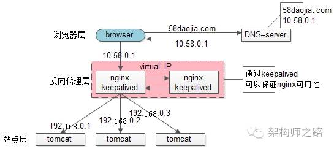

# 高可用方案（3）keepalived

为了解决高可用的问题，keepalived出场了（之前的文章“[使用shadow-master保证系统可用性](http://mp.weixin.qq.com/s?__biz=MjM5ODYxMDA5OQ==&mid=2651959480&idx=1&sn=337bd74410a6bef616128fd17abd08a8&scene=21#wechat_redirect)”详细介绍过）：

此时：

1）做两台nginx组成一个集群，分别部署上keepalived，设置成相同的虚IP，保证nginx的高可用

2）当一台nginx挂了，keepalived能够探测到，并将流量自动迁移到另一台nginx上，整个过程对调用方透明

优点：

1）解决了高可用的问题

缺点：

1）资源利用率只有50%

2）nginx仍然是接入单点，如果接入吞吐量超过的nginx的性能上限怎么办，例如qps达到了50000咧？

# scale up扩容方案（4）lvs/f5

nginx毕竟是软件，性能比tomcat好，但总有个上限，超出了上限，还是扛不住。

lvs就不一样了，它实施在操作系统层面；f5的性能又更好了，它实施在硬件层面；它们性能比nginx好很多，例如每秒可以抗10w，这样可以利用他们来扩容，常见的架构图如下：

此时：

1）如果通过nginx可以扩展多个tomcat一样，可以通过lvs来扩展多个nginx

2）通过keepalived+VIP的方案可以保证可用性，99.9999%的公司到这一步基本就能解决接入层高可用、扩展性、负载均衡的问题。

 

这就完美了嘛？还有潜在问题么？

好吧，不管是使用lvs还是f5，这些都是scale up的方案，根本上，lvs/f5还是会有性能上限，假设每秒能处理10w的请求，一天也只能处理80亿的请求（10w秒吞吐量*8w秒），那万一系统的日PV超过80亿怎么办呢？（好吧，没几个公司要考虑这个问题）

# scale out扩容方案（5）DNS轮询

如之前文章所述，水平扩展，才是解决性能问题的根本方案，能够通过加机器扩充性能的方案才具备最好的扩展性。

facebook，google，baidu的PV是不是超过80亿呢，它们的域名只对应一个ip么，终点又是起点，还是得通过DNS轮询来进行扩容：
此时：

1）通过DNS轮询来线性扩展入口lvs层的性能

2）通过keepalived来保证高可用

3）通过lvs来扩展多个nginx

4）通过nginx来做负载均衡，业务七层路由