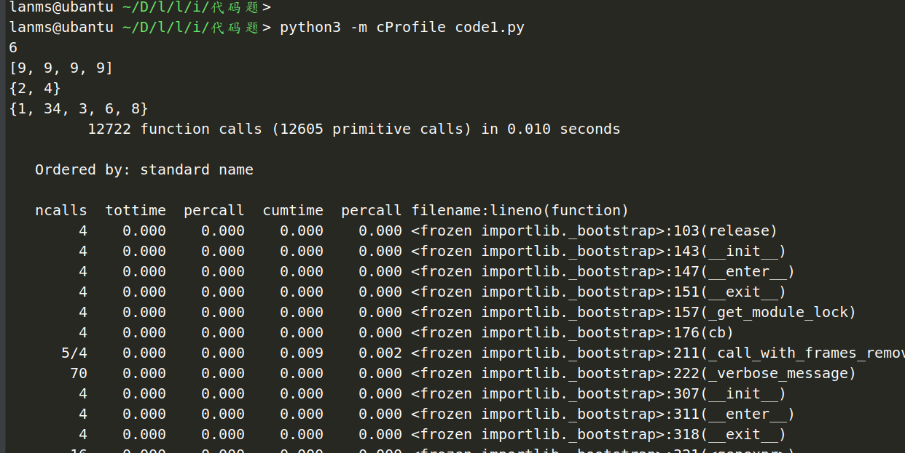

https://cloud.tencent.com/developer/article/1165209

不同的场景有不同的优化方式，总得来说，一般有分治，分支界限，贪心，动态规划等思想。

**使用性能分析工具**

除了上面在 ipython 使用到的 timeit 模块，还有 cProfile。cProfile 的使用方式也非常简单： python3 -m cProfile filename.py，filename.py 是要运行程序的文件名，可以在标准输出中看到每一个函数被调用的次数和运行的时间，从而找到程序的性能瓶颈，然后可以有针对性地优化

